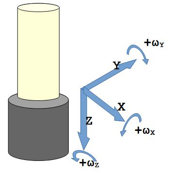

# NeoPixelLamp <!-- omit in toc -->

A lamp with some NeoPixels and a 3D-accelerometer, 3D-gyroscope and 3D-magnetometer.

* [Used Libraries](#used-libraries)
* [Issues, Ideas And Bugs](#issues-ideas-and-bugs)
* [License](#license)
* [Contribution](#contribution)

## Description

The NeoPixelLamp controls a lamp of
* an [Adafruit FLORA V2](https://www.adafruit.com/products/659),
* an [Adafruit NeoPixel Ring - 16](https://www.adafruit.com/product/1463),
* an [Adafruit FLORA 9-DOF Accelerometer/Gyroscope/Magnetometer - LSM9DS0 - v1.0](https://www.adafruit.com/product/2020),
* an [Sparkfun USB LiPoly Charger - Single Cell](https://www.sparkfun.com/products/12711) and
* a LiPo Akku with 400mAh.

### Animations
Choose different color animations.

1. Rainbow colors.
2. Theatre-style crawling lights with rainbow effect.
3. Color changes dependen on the temperature.
4. Color can be changed by rotating around the z-axis.
5. Color moves like knight rider.

### User interface
* Shake the lamp according to the z-axis to switch between different programs.
* Turn the lamp about 90 degree and rotate it to increase or decrease the LED brightness.
* Turn the lamp about 180 degree and it will jump into deep standby.

# Used Libraries

| Library | Description | License |
| - | - | - |
| [Arduino](https://github.com/platformio/platform-espressif32) | ESP32 Arduino framework | Apache-2.0 |
| [Adafruit_NeoPixel](https://github.com/adafruit/Adafruit_NeoPixel) | NeoPixel driver | LGPL-3.0 |
| [Adafruit_LSM9DS0_Library](https://github.com/adafruit/Adafruit_LSM9DS0_Library) | LSM9DS0 driver | BSD |
| [Adafruit_Sensor](https://github.com/adafruit/Adafruit_Sensor) | Sensor generalization | Apache-2.0 |

# Issues, Ideas And Bugs
If you have further ideas or you found some bugs, great! Create a [issue](https://github.com/BlueAndi/NeoPixelLamp/issues) or if you are able and willing to fix it by yourself, clone the repository and create a pull request.

# License
The whole source code is published under the [MIT license](http://choosealicense.com/licenses/mit/).
Consider the different licenses of the used third party libraries too!

# Contribution
Unless you explicitly state otherwise, any contribution intentionally submitted for inclusion in the work by you, shall be licensed as above, without any
additional terms or conditions.
